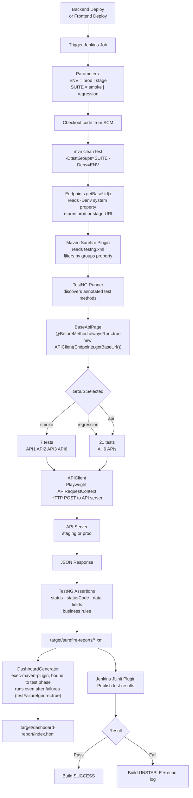

# Voice Banking — Automation Suite

API and UI test automation for the Voice Banking platform.  
**Current coverage: 9 APIs (21 test methods) + 7 UI/voice screens (incl. a 43-query voice balance-inquiry regression suite), 2 environments (stage + prod).**

---

## Quick Start

```bash
# Run all tests — defaults to prod URL
mvn clean test

# Run smoke suite against prod
mvn clean test -DtestGroups=smoke -Denv=prod

# Run smoke suite against stage
mvn clean test -DtestGroups=smoke -Denv=stage

# Run full regression against stage
mvn clean test -DtestGroups=regression -Denv=stage

# Run all UI tests
mvn clean test -DtestGroups=ui

# Run just the voice balance-inquiry regression suite (43 queries)
mvn clean test -DtestGroups=botverification

# Run a UI test headed (visible browser) instead of the CI default (headless)
mvn clean test -Dtest=UI7_BalanceInquiryTest -Dheadless=false
```

---

## Technology Stack

| Component | Technology | Version |
|---|---|---|
| Language | Java (Eclipse Temurin) | 21 |
| Build | Maven | 3.8+ |
| Test Framework | TestNG | 7.x |
| HTTP Client | Java `java.net.http.HttpClient` | 21 built-in |
| JSON Parsing | Jackson Databind | 2.16.0 |
| CI/CD | Jenkins Declarative Pipeline | — |

---

## Code Flow



---

## Test Groups

| Group | Tests | Purpose |
|---|---|---|
| `smoke` | 9 methods (API1, API2, API3, API6, UI11) | Quick sanity after any deploy |
| `regression` | 21 API methods + all UI classes | Full regression |
| `api` | 21 methods (all 9 APIs) | Run all API tests |
| `ui` | UI1–UI7 | Run all UI tests |
| `botverification` | UI7 — 43 voice balance-inquiry queries | Voice/bot-response regression suite |

---

## Environments

| Environment | URL | How selected |
|---|---|---|
| `prod` | `http://98.93.75.232:9090` | `-Denv=prod` or default (no flag) |
| `stage` | `http://3.111.41.3:9090` | `-Denv=stage` |

---

## Project Structure

```
voicebanking/
├── src/test/java/com/voicebanking/
│   ├── DataText/
│   │   ├── Constants.java          # API test data, expected values
│   │   ├── Endpoints.java          # API paths + base URLs, UI base URL
│   │   ├── VoiceQueries.java       # Spoken query text for voice tests
│   │   └── BotResponsePatterns.java # Regex patterns for bot responses (Balance.ANY/SAVINGS/CURRENT)
│   ├── utils/
│   │   ├── APIClient.java          # Playwright HTTP wrapper
│   │   └── TtsUtil.java            # Generates/deletes WAV files for fake-mic voice input
│   ├── pages/
│   │   ├── BaseApiPage.java        # @BeforeMethod — creates APIClient
│   │   ├── BasePage.java           # Shared Playwright browser setup for non-voice UI tests
│   │   ├── HomePage.java, WelcomePage.java, OtpPage.java, LanguagePage.java, VoiceRegistrationPage.java
│   ├── tests/api/
│   │   ├── API1_GetAccountListTest.java
│   │   ├── API2_GetCustomerInfoTest.java
│   │   ├── API3_GetAccountBalanceTest.java
│   │   ├── API4_GetBeneficiariesListTest.java
│   │   ├── API5_GetTransactionsListTest.java
│   │   ├── API6_TransferMoneyTest.java
│   │   ├── API8_GetLoanStatementTest.java
│   │   ├── API9_GetLoanOverdueDetailsTest.java
│   │   └── API10_GetLoanSummaryListTest.java
│   └── tests/ui/
│       ├── base/BaseVoiceTest.java # Chromium + fake-mic lifecycle, shared runVoiceQuery() flow
│       ├── UI1_WelcomePageTest.java
│       ├── UI2_LoginTest.java
│       ├── UI3_OtpTest.java
│       ├── UI4_LanguageTest.java
│       ├── UI5_VoiceRegistrationTest.java
│       ├── UI6_HomePageTest.java
│       └── UI7_BalanceInquiryTest.java   # 43-query voice balance-inquiry regression suite
├── testng.xml                      # Suite — all API + UI classes
├── Jenkinsfile                     # CI pipeline
├── pom.xml                         # Maven config
├── skills.md                       # AI skills — tool-agnostic rules for API AND UI/voice test generation
├── TEST_PLAN.md                    # Full test plan + roadmap (API + UI)
├── TEST_CASES.xlsx                 # Test case register
├── QUICK_REFERENCE.md              # Commands cheat sheet (API + UI)
├── MICROPHONE_TESTING_GUIDE.md     # Voice/microphone reference
└── BDD_FRAMEWORKS_GUIDE.md         # BDD options reference (API + UI)
```

---

## API Coverage

| API | Endpoint | Groups | Auto |
|---|---|---|---|
| 1 — Account List | POST `/api/v1/accounts/list` | smoke, regression, api | ✅ |
| 2 — Customer Info | POST `/api/v1/customers/info` | smoke, regression, api | ✅ |
| 3 — Account Balance | POST `/api/v1/accounts/balance` | smoke, regression, api | ✅ |
| 4 — Beneficiaries | POST `/api/v1/beneficiaries/list` | regression, api | ✅ |
| 5 — Transactions | POST `/api/v1/transactions/list` | regression, api | ✅ |
| 6 — Transfer Money | POST `/api/v1/transactions/transfer` | smoke, regression, api | ✅ |
| 7 — (out of scope) | — | — | — |
| 8 — Loan Statement | POST `/api/v1/loans/statement` | regression, api | ✅ |
| 9 — Loan Overdue | POST `/api/v1/loans/overdue` | regression, api | ✅ |
| 10 — Loan Summary | POST `/api/v1/loans/summary` | regression, api | ✅ |
| 11–13 — (out of scope) | — | — | — |

---

## UI / Voice Coverage

| Screen | Test Class | Groups | Auto |
|---|---|---|---|
| Welcome / phone entry | UI1_WelcomePageTest | ui, regression | ✅ |
| Login | UI2_LoginTest | ui, regression | ✅ |
| OTP | UI3_OtpTest | ui, regression | ✅ |
| Language selection | UI4_LanguageTest | ui, regression | ✅ |
| Voice registration | UI5_VoiceRegistrationTest | ui, regression | ✅ |
| Home screen | UI6_HomePageTest | ui, regression | ✅ |
| Voice balance inquiry (43 queries) | UI7_BalanceInquiryTest | ui, regression, botverification | ✅ |
| Transfer / beneficiary UI flows | — | — | 🔜 planned |

UI7 drives real speech via Chromium's `--use-file-for-fake-audio-capture` (a generated WAV per query), asserts the bot's response against regex patterns in `BotResponsePatterns.Balance`, and handles account disambiguation ("which account — savings or current?") with a retry loop for flaky fake-audio timing. See [TEST_PLAN.md](TEST_PLAN.md) → Section 4 for details.

---

## Jenkins Pipeline

The `Jenkinsfile` in the repo root defines the pipeline.

**Parameters:**

| Parameter | Options | Default |
|---|---|---|
| `ENV` | `prod`, `stage` | `prod` |
| `SUITE` | `smoke`, `regression` | — |

**No Jenkins global environment variables required** — URLs are hardcoded in `Endpoints.java` and selected via `-Denv`.

**Auto-trigger** — dev teams call this after deployment:
```bash
curl -X POST "http://JENKINS_URL/job/voicebanking-automation/buildWithParameters" \
  --user "username:api_token" \
  --data "token=voicebanking-trigger&ENV=stage&SUITE=smoke"
```

---

## Test Results

Results in `target/surefire-reports/`, `target/extent-report/index.html`, and `target/dashboard-report/index.html`.

```bash
# Run tests — Extent report and dashboard report both auto-generate
mvn clean test -Denv=stage

# Open Extent report (Windows)
start target\extent-report\index.html

# Open dashboard report (Windows)
start target\dashboard-report\index.html
```

The dashboard report (`DashboardGenerator`, bound to the Maven `test` phase via `exec-maven-plugin`) parses `target/surefire-reports`, matches each failed test to its `ScreenshotUtil` screenshot, and writes one self-contained `index.html` — module pass-rate breakdown, a searchable results table, and inlined failure screenshots, no `screenshots/` folder needed alongside it.

Maven Surefire runs with `testFailureIgnore=true`, so `mvn clean test` always completes (exit 0) even when tests fail — this is what lets the dashboard step run after a failing suite instead of the build stopping at Surefire. Whether a run had failures is read from the report contents (or the `junit` step in Jenkins), not the Maven exit code.

Jenkins publishes both reports as downloadable artifacts and as build-page links — **"Test Report"** (Extent) and **"Dashboard"** (dashboard report) — requires the HTML Publisher plugin.

---

## Future: UI Automation Beyond Balance Inquiry

Login, OTP, language, voice registration, home screen, and voice balance inquiry are already automated (see UI/Voice Coverage above). Still planned:
- Transfer money end-to-end UI flow
- Beneficiary add / edit
- Voice commands beyond balance inquiry (transfers, beneficiaries)
- Cross-browser UI runs

See [TEST_PLAN.md](TEST_PLAN.md) → Section 4 for the full UI roadmap.

---

## Documentation

| File | Purpose |
|---|---|
| [README.md](README.md) | This file — start here |
| [skills.md](skills.md) | AI skills — tool-agnostic rules for API AND UI/voice test generation |
| [TEST_PLAN.md](TEST_PLAN.md) | Full test plan, strategy, roadmap (API + UI) |
| [TEST_CASES.xlsx](TEST_CASES.xlsx) | All test cases (automated + manual) with groups |
| [QUICK_REFERENCE.md](QUICK_REFERENCE.md) | Commands cheat sheet, common issues (API + UI) |
| [MICROPHONE_TESTING_GUIDE.md](MICROPHONE_TESTING_GUIDE.md) | Voice/microphone reference — see "Actual Implementation" section for this project's real setup |
| [BDD_FRAMEWORKS_GUIDE.md](BDD_FRAMEWORKS_GUIDE.md) | BDD options for future consideration (API + UI) |

---

**Status**: API automation complete ✅ | UI automation in progress 🔄 (Welcome/Login/OTP/Language/VoiceRegistration/Home + 43-query voice Balance Inquiry done; Transfer/Beneficiary UI + voice flows planned)  
**Java**: 21 | **Framework**: TestNG | **CI**: Jenkins
