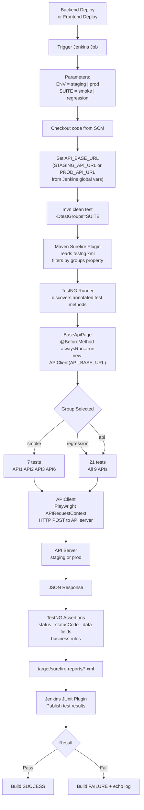

# Voice Banking — Automation Suite

API and UI test automation for the Voice Banking platform.  
**Current coverage: 9 APIs, 21 test methods, 2 environments (staging + prod).**

---

## Quick Start

```bash
# Run all tests (uses fallback prod URL)
mvn clean test

# Run smoke suite
mvn clean test -DtestGroups=smoke

# Run regression suite
mvn clean test -DtestGroups=regression

# Run against staging
mvn clean test -DtestGroups=smoke -DAPI_BASE_URL=http://staging-server:9090
```

---

## Technology Stack

| Component | Technology | Version |
|---|---|---|
| Language | Java (Eclipse Temurin) | 21 |
| Build | Maven | 3.8+ |
| Test Framework | TestNG | 7.x |
| HTTP Client | Playwright `APIRequestContext` | 1.50.0 |
| JSON Parsing | Jackson Databind | 2.16.0 |
| CI/CD | Jenkins Declarative Pipeline | — |

---

## Code Flow



---

## Test Groups

| Group | Tests | Purpose |
|---|---|---|
| `smoke` | 7 methods (API1, API2, API3, API6) | Quick sanity after any deploy |
| `regression` | 21 methods (all 9 APIs) | Full regression |
| `api` | 21 methods (all 9 APIs) | Run all API tests |

---

## Environments

| Environment | URL | Trigger |
|---|---|---|
| `staging` | `STAGING_API_URL` Jenkins global var | Every backend/frontend deploy to staging |
| `prod` | `PROD_API_URL` Jenkins global var | Every deploy to prod |

---

## Project Structure

```
voicebanking/
├── src/test/java/com/voicebanking/
│   ├── DataText/
│   │   ├── Constants.java          # Test data, expected values
│   │   └── Endpoints.java          # API paths + base URLs
│   ├── utils/
│   │   └── APIClient.java          # Playwright HTTP wrapper
│   ├── pages/
│   │   └── BaseApiPage.java        # @BeforeMethod — creates APIClient
│   └── tests/api/
│       ├── API1_GetAccountListTest.java
│       ├── API2_GetCustomerInfoTest.java
│       ├── API3_GetAccountBalanceTest.java
│       ├── API4_GetBeneficiariesListTest.java
│       ├── API5_GetTransactionsListTest.java
│       ├── API6_TransferMoneyTest.java
│       ├── API8_GetLoanStatementTest.java
│       ├── API9_GetLoanOverdueDetailsTest.java
│       └── API10_GetLoanSummaryListTest.java
├── testng.xml                      # Suite — all 9 classes
├── Jenkinsfile                     # CI pipeline
├── pom.xml                         # Maven config
├── TEST_PLAN.md                    # Full test plan + roadmap
├── TEST_CASES.xlsx                 # Test case register
├── QUICK_REFERENCE.md              # Commands cheat sheet
├── MICROPHONE_TESTING_GUIDE.md    # Future voice testing reference
└── BDD_FRAMEWORKS_GUIDE.md        # Future BDD options reference
```

---

## API Coverage

| API | Endpoint | Groups | Auto |
|---|---|---|---|
| 1 — Account List | POST `/api/v1/accounts/list` | smoke, regression, api | ✅ |
| 2 — Customer Info | POST `/api/v1/customers/info` | smoke, regression, api | ✅ |
| 3 — Account Balance | POST `/api/v1/accounts/balance` | smoke, regression, api | ✅ |
| 4 — Beneficiaries | POST `/api/v1/beneficiaries/list` | regression, api | ✅ |
| 5 — Transactions | POST `/api/v1/transactions/list` | regression, api | ✅ |
| 6 — Transfer Money | POST `/api/v1/transactions/transfer` | smoke, regression, api | ✅ |
| 7 — (out of scope) | — | — | — |
| 8 — Loan Statement | POST `/api/v1/loans/statement` | regression, api | ✅ |
| 9 — Loan Overdue | POST `/api/v1/loans/overdue` | regression, api | ✅ |
| 10 — Loan Summary | POST `/api/v1/loans/summary` | regression, api | ✅ |
| 11–13 — (out of scope) | — | — | — |

---

## Jenkins Pipeline

The `Jenkinsfile` in the repo root defines the pipeline.

**Parameters:**

| Parameter | Options |
|---|---|
| `ENV` | `staging`, `prod` |
| `SUITE` | `smoke`, `regression` |

**DevOps must configure these Jenkins global environment variables:**

| Variable | Example |
|---|---|
| `STAGING_API_URL` | `http://staging-server:9090` |
| `PROD_API_URL` | `http://98.93.75.232:9090` |

**Auto-trigger setup** (DevOps to configure on backend/frontend deploy jobs):

```
After successful backend deploy to staging  → trigger this job: ENV=staging, SUITE=smoke
After successful frontend deploy to staging → trigger this job: ENV=staging, SUITE=smoke
After successful deploy to prod             → trigger this job: ENV=prod,    SUITE=smoke
Nightly scheduled (staging)                 → trigger this job: ENV=staging, SUITE=regression
```

---

## Test Results

Results in `target/surefire-reports/`.

```bash
# HTML report
mvn surefire-report:report
# Opens: target/site/surefire-report.html
```

---

## Future: UI Automation

UI automation is planned using Playwright browser APIs (same framework dependency already in `pom.xml`).

Planned coverage:
- Login / Logout
- Account list and balance screens
- Transfer money flow
- Loan summary and statement pages
- Voice / Microphone permission and voice command tests

See [TEST_PLAN.md](TEST_PLAN.md) → Section 4 for the full UI roadmap.

---

## Documentation

| File | Purpose |
|---|---|
| [README.md](README.md) | This file — start here |
| [TEST_PLAN.md](TEST_PLAN.md) | Full test plan, strategy, roadmap |
| [TEST_CASES.xlsx](TEST_CASES.xlsx) | All test cases (automated + manual) with groups |
| [QUICK_REFERENCE.md](QUICK_REFERENCE.md) | Commands cheat sheet, common issues |
| [MICROPHONE_TESTING_GUIDE.md](MICROPHONE_TESTING_GUIDE.md) | Voice/microphone implementation reference |
| [BDD_FRAMEWORKS_GUIDE.md](BDD_FRAMEWORKS_GUIDE.md) | BDD options for future consideration |

---

**Status**: API automation complete ✅ | UI automation planned 🔜  
**Java**: 21 | **Framework**: TestNG | **CI**: Jenkins
